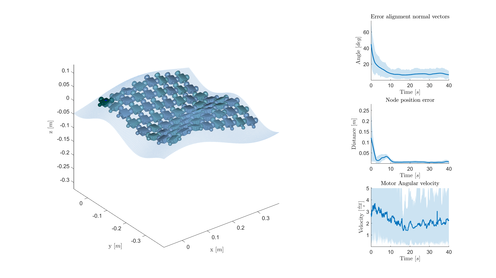
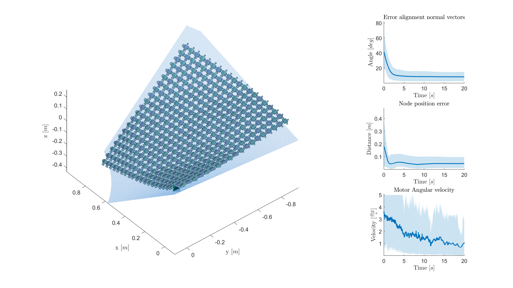
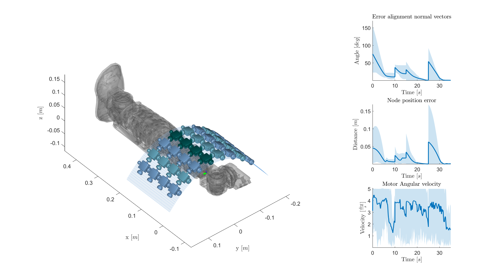

<h1 align="center">
Modeling and Control of Morphing Covers for the Adaptive Morphology of Humanoid Robots
</h1>


<div align="center">


_F. Bergonti, G. Nava, L. Fiorio, G. L'Erario, D. Pucci "Modeling and Control of Morphing Covers for the Adaptive Morphology of Humanoid Robots" in 
Paper Name, vol. 1, no. 1, pp. 1-6, Month Year, doi: 10.1093/ajae/aaq063_

</div>

<p align="center">

https://user-images.githubusercontent.com/38210073/169066254-753c29e0-2e25-4599-a52d-9dca5fe05105.mp4

</p>

<div align="center">
  IEEE Transactions on Robotics
</div>

<div align="center">
  <a href="#installation"><b>Installation</b></a> |
  <a href="paper_link_to_do"><b>Paper</b></a> |
  <a href="https://youtu.be/kMfXb2xqGn4"><b>Video</b></a>
</div>

## Abstract

This paper takes a step to provide humanoid robots with adaptive morphology abilities. We present a systematic approach for enabling robotic covers to  morph their shape, with an overall size fitting the anthropometric dimensions of a humanoid robot. More precisely, we  present a cover concept consisting of two main components: a skeleton, which is a repetition of a basic element called node; a soft membrane,  which encloses the cover and deforms with its motion. The paper focuses on the cover skeleton, and addresses the challenging problems of: node design; system modeling; motor positioning; and control design of the morphing system. The cover modeling  focuses on kinematics, and a systematic approach for defining the system kinematic constraints is presented. Then, we apply genetic algorithms to find the motor locations so as the morphing cover is fully actuated. Finally, we present control algorithms that allow the cover to morph into a time varying shape. The entire approach is validated by performing kinematic simulations with four different covers of square dimensions and having 3x3, 4x8, 8x8, and 20x20 nodes, respectively. For each cover, we apply the genetic algorithms to choose the motor locations and perform simulations for tracking a desired shape. The simulation results show that the presented approach ensures the covers to track a desired shape with good tracking performances.

## Installation

1. Clone [`this`](https://github.com/ami-iit/paper_bergonti_2022_tro_kinematics-control-morphingcovers) repository  and [`mystica`](https://github.com/ami-iit/mystica/):
  ```bash
  git clone https://github.com/ami-iit/paper_bergonti_2022_tro_kinematics-control-morphingcovers.git
  git clone https://github.com/ami-iit/mystica.git
  ```
  [mystica](https://github.com/ami-iit/mystica/) is a matlab library to simulate the kinematics and dynamics of multibody systems.

2. Run in **matlab** the function [`install()`](https://github.com/ami-iit/mystica/blob/main/install.m) stored in [`mystica`](https://github.com/ami-iit/mystica/):
  ``` matlab
  install('env_name','imorph')
  ```
The function [`install()`](https://github.com/ami-iit/mystica/blob/main/install.m) downloads [`mambaforge`](https://github.com/conda-forge/miniforge#mambaforge). [`mambaforge`](https://github.com/conda-forge/miniforge#mambaforge) is a package manager that downloads and configures our dependencies in conda enviroment called `imorph`.

## Usage

This repository stores:
- the algorithm for evaluating an optimal motor positioning for structures with closed kinematic loops (see Sec.IV of the [paper](paper_link_to_do));
- the instantaneous controller that evaluates motors speed to make the cover skeleton moves toward the desired shape (see Sec.V of the [paper](paper_link_to_do));
- the scripts for reproducing the simulations described in Sec.VI of the [paper](paper_link_to_do).

**Reproducing simulations results**

1. If you have completed the [installation procedure](#installation) successfully, a file `setup.m` is generated in `mystica\deps`. You have to open Matlab and run the script `setup.m` to configure MATLABPATH.

2. Run one of the four scripts stored in [this folder](scripts). For example, to reproduce the result of the first scenario you have to run:
``` matlab
cd paper_bergonti_2022_tro_kinematics-control-morphingcovers
cd scripts
run('sim1')
```

If you open the script, you can modify the `config.simulation_with_noise` parameter deciding whether to apply noise. Instead, the parameter `config.run_only_controller` allows you to choose if you want to run only the controller without evaluating a new motor placement.

| # | mesh | script | result |
| - | - | - | - |
| 1 | 3x3   | [sim1.m](scripts/sim1.m) |  |
| 2 | 8x8   | [sim2.m](scripts/sim2.m) |  |
| 3 | 20x20 | [sim3.m](scripts/sim3.m) |  |
| 4 | 4x8   | [sim4.m](scripts/sim4.m) |  |

## Citing this work

If you find the work useful, please consider citing:

```bibtex
@ARTICLE{ajae/aaq063,
  author={Author1, Alfred and Author2, Beatrice},
  journal={Journal},
  title={Paper Tile},
  year={2021},
  volume={1},
  number={1},
  pages={1-6},
  doi={10.1093/ajae/aaq063}}
```

### Maintainer

This repository is maintained by:

| | |
|:---:|:---:|
| [](https://github.com/FabioBergonti) | [@FabioBergonti](https://github.com/FabioBergonti) |
